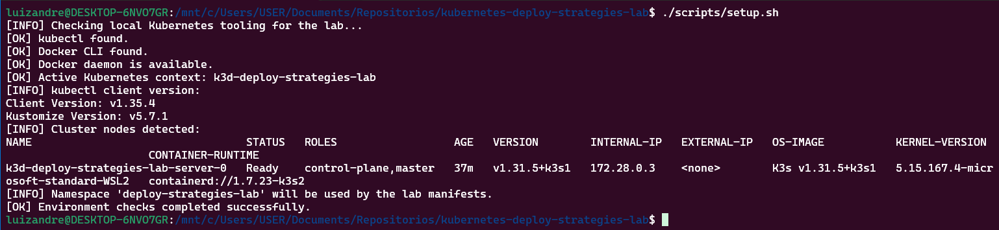
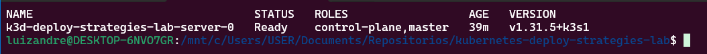
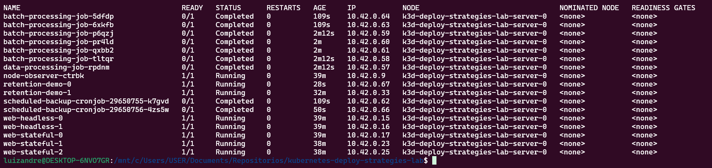
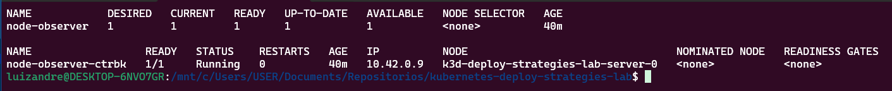
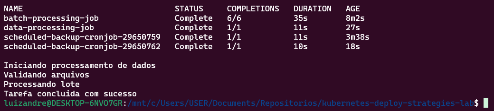
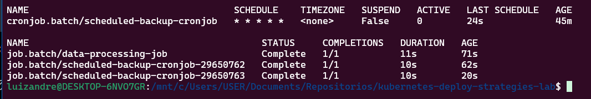
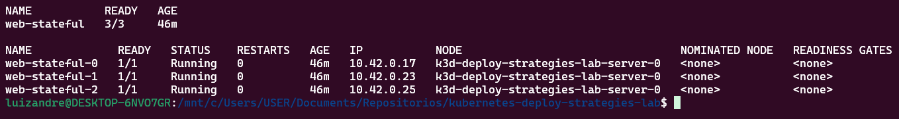
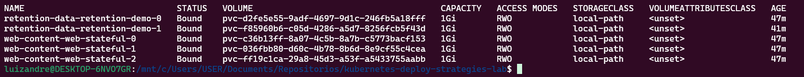
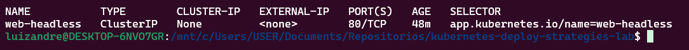
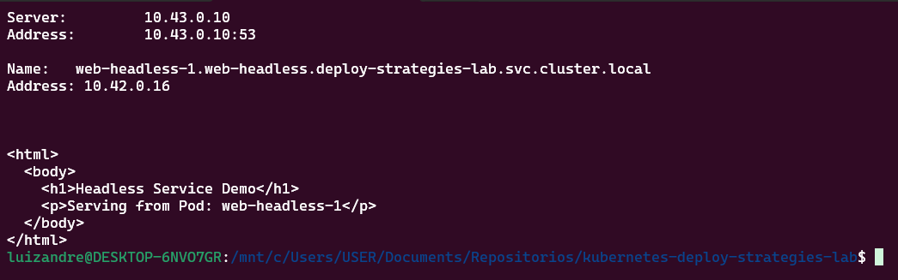

# Kubernetes Deploy Strategies Lab


Laboratório prático para estudar e demonstrar diferentes estratégias de deploy no Kubernetes, com foco em organização de manifests, execução local e documentação técnica voltada para portfólio profissional.

## Acesso Rapido

| Area | Objetivo | Link |
|---|---|---|
| Documentacao tecnica | Explicacoes conceituais, comandos `kubectl` e troubleshooting | [docs/README.md](docs/README.md) |
| Manifests | Estrutura dos exemplos por tema e ordem de estudo | [manifests/README.md](manifests/README.md) |
| Scripts | Automacao para setup, aplicacao, validacao e limpeza | [scripts/README.md](scripts/README.md) |
| Evidencias | Pasta sugerida para salvar prints reais do laboratorio | [assets/screenshots/](assets/screenshots/) |
| Divulgacao profissional | Materiais prontos para publicacao no LinkedIn | [linkedin/README.md](linkedin/README.md) |

## Sobre o Projeto

Este repositório reúne exemplos objetivos e reproduzíveis de workloads do Kubernetes, organizados para estudo progressivo e apresentação técnica. A proposta é praticar cenários comuns de operação em ambiente local usando `kubectl`, `Docker Desktop`, `WSL2`, `k3d` ou `kind`, mantendo uma estrutura clara e atrativa para recrutadores.

Se voce estiver avaliando este repositorio como portfolio, a melhor leitura e: `README.md` -> `docs/README.md` -> `manifests/` -> `assets/screenshots/`.

## Objetivo Profissional 🎯

Este laboratório foi criado para demonstrar, de forma prática, minha capacidade de:

- estruturar manifests Kubernetes com organização e padronização
- compreender diferentes tipos de workloads e seus casos de uso
- trabalhar com persistência, execução batch e descoberta de serviço
- documentar ambientes técnicos com clareza
- transformar estudo técnico em evidência profissional para portfólio

## Tecnologias Utilizadas

- Kubernetes
- kubectl
- Docker Desktop
- WSL2 Ubuntu
- k3d ou kind
- YAML
- GitHub Actions

## Tópicos Estudados

- DaemonSet
- Job
- CronJob
- StatefulSet
- Retenção de Volume
- Headless Service

## Arquitetura do Projeto 🗂️

```text
.
├── .github/
│   └── workflows/
│       └── validate-kubernetes-yaml.yml
├── assets/
│   └── screenshots/
├── docs/
│   ├── 01-introducao.md
│   ├── 02-daemonset.md
│   ├── 03-job.md
│   ├── 04-cronjob.md
│   ├── 05-statefulset.md
│   ├── 06-volume-retention.md
│   ├── 07-headless-service.md
│   ├── 08-comandos-uteis.md
│   ├── 09-troubleshooting.md
│   ├── README.md
│   └── kind-storageclass.md
├── linkedin/
│   ├── README.md
│   ├── carousel-outline.md
│   ├── post-linkedin.md
│   └── post-template.md
├── manifests/
│   ├── 00-namespace/
│   │   └── namespace.yaml
│   ├── 01-daemonset/
│   │   └── daemonset.yaml
│   ├── 02-job/
│   │   └── job.yaml
│   ├── 03-job-advanced/
│   │   └── job-advanced.yaml
│   ├── 04-cronjob/
│   │   └── cronjob.yaml
│   ├── 05-statefulset/
│   │   ├── service.yaml
│   │   └── statefulset.yaml
│   ├── 06-statefulset-volume-retention/
│   │   ├── service.yaml
│   │   └── statefulset-retention.yaml
│   ├── 07-headless-service/
│   │   ├── headless-service.yaml
│   │   └── statefulset-headless-demo.yaml
│   └── README.md
├── scripts/
│   ├── apply-all.sh
│   ├── apply-lab.sh
│   ├── check.sh
│   ├── cleanup.sh
│   ├── lint-yaml.sh
│   ├── setup.sh
│   └── README.md
├── .gitignore
├── .yamllint.yml
├── LICENSE
└── README.md
```

## Explicação Simples dos Workloads e Conceitos

| Item | O que é | Quando faz sentido usar |
|---|---|---|
| DaemonSet | Garante um Pod por node, ou por um grupo específico de nodes. | Agentes de log, monitoramento, segurança e coleta de métricas. |
| Job | Executa uma tarefa até a conclusão. | Processos únicos, importações, migrações e cargas batch. |
| CronJob | Agenda Jobs em horários definidos. | Rotinas periódicas, backups, relatórios e limpezas automatizadas. |
| StatefulSet | Gerencia Pods com identidade estável e armazenamento persistente. | Bancos de dados, filas, caches distribuídos e aplicações stateful. |
| Retenção de Volume | Define o comportamento dos PVCs quando o StatefulSet é removido ou reduzido. | Cenários em que os dados precisam ser preservados com controle. |
| Headless Service | Service sem IP virtual, usado para descoberta direta dos Pods. | Aplicações stateful que precisam resolver cada instância individualmente. |

## Pré-requisitos

Antes de executar o laboratório, tenha o seguinte ambiente pronto:

- Windows 11 com WSL2 habilitado
- Ubuntu instalado no WSL2
- Docker Desktop em execução
- `kubectl` instalado e funcional
- `k3d` ou `kind` instalado
- `yamllint` instalado para validacao local dos arquivos YAML ou Docker disponivel para usar o fallback do script

Instalacao opcional do `yamllint` local:

```bash
pip install yamllint
```

Se preferir, o script `./scripts/lint-yaml.sh` tambem consegue usar Docker automaticamente quando `yamllint` nao estiver instalado na maquina.

Permissao recomendada para os scripts:

```bash
chmod +x scripts/*.sh
```

## Como Executar o Laboratório 🚀

### 1. Criar um cluster local

Opção com `k3d`:

```bash
k3d cluster create deploy-strategies-lab
kubectl cluster-info
```

Opção com `kind`:

```bash
kind create cluster --name deploy-strategies-lab
kubectl cluster-info
```

### 2. Validar o ambiente

```bash
./scripts/setup.sh
```

Se quiser registrar a validacao completa do ambiente, consulte a captura gerada em `assets/screenshots/00-setup-environment-check.png`.



Comando sugerido para registrar a disponibilidade do cluster:

```bash
kubectl get nodes
```

Imagem gerada em `assets/screenshots/01-kubectl-get-nodes.png`.



### 3. Aplicar todos os manifests

```bash
./scripts/apply-all.sh
```

### 4. Aplicar por etapa, se quiser estudar de forma progressiva

```bash
kubectl apply -f manifests/00-namespace/
kubectl apply -f manifests/01-daemonset/
kubectl apply -f manifests/02-job/
kubectl apply -f manifests/03-job-advanced/
kubectl apply -f manifests/04-cronjob/
kubectl apply -f manifests/05-statefulset/service.yaml
kubectl apply -f manifests/05-statefulset/statefulset.yaml
kubectl apply -f manifests/06-statefulset-volume-retention/service.yaml
kubectl apply -f manifests/06-statefulset-volume-retention/statefulset-retention.yaml
kubectl apply -f manifests/07-headless-service/headless-service.yaml
kubectl apply -f manifests/07-headless-service/statefulset-headless-demo.yaml
```

### 5. Verificar os recursos principais

```bash
./scripts/check.sh
```

### 6. Validar os arquivos YAML localmente

```bash
./scripts/lint-yaml.sh
```

Depois de publicar no GitHub, capture a execucao real do workflow `Validate Kubernetes YAML` e salve o print em `assets/screenshots/10-github-actions-yaml-validation.png`.

Observacao: esse print depende do `git push` e da execucao real do GitHub Actions, por isso nao foi gerado localmente junto com as evidencias do cluster.

## Como Validar os Recursos Criados ✅

### Visao Geral do Laboratorio

Verificar o namespace:

```bash
kubectl get ns deploy-strategies-lab
```

Verificar os Pods do laboratorio:

```bash
kubectl get pods -n deploy-strategies-lab -o wide
```

Imagem gerada em `assets/screenshots/02-kubectl-get-pods-wide.png`.



Verificar os workloads:

```bash
kubectl get daemonset,job,cronjob,statefulset -n deploy-strategies-lab
```

Verificar os Services:

```bash
kubectl get svc -n deploy-strategies-lab
```

Verificar os volumes persistentes:

```bash
kubectl get pvc -n deploy-strategies-lab
```

### DaemonSet

Validar que existe um Pod `node-observer` por node:

```bash
kubectl get daemonset node-observer -n deploy-strategies-lab
kubectl get pods -n deploy-strategies-lab -l app.kubernetes.io/name=node-observer -o wide
```

Imagem gerada em `assets/screenshots/03-daemonset-pod-por-node.png`.



### Job

Validar o `Job` simples e o status `Completed`:

```bash
kubectl get jobs -n deploy-strategies-lab
kubectl logs job/data-processing-job -n deploy-strategies-lab
```

Imagem gerada em `assets/screenshots/04-job-completed.png`.



### CronJob

Validar que o `CronJob` gera novos `Jobs` automaticamente:

```bash
kubectl get cronjobs,jobs -n deploy-strategies-lab
kubectl get jobs -n deploy-strategies-lab -w
```

Imagem gerada em `assets/screenshots/05-cronjob-jobs-automaticos.png`.



### StatefulSet

Validar a identidade estavel dos Pods:

```bash
kubectl get statefulset web-stateful -n deploy-strategies-lab
kubectl get pods -n deploy-strategies-lab -l app.kubernetes.io/name=web-stateful -o wide
```

Imagem gerada em `assets/screenshots/06-statefulset-pods-estaveis.png`.



### Volumes Persistentes

Validar os PVCs criados pelos exemplos stateful:

```bash
kubectl get pvc -n deploy-strategies-lab
```

Imagem gerada em `assets/screenshots/07-statefulset-pvcs.png`.



Para aprofundar a inspecao:

```bash
kubectl describe pvc -n deploy-strategies-lab
```

### Headless Service

Validar o `Headless Service` com `clusterIP: None`:

```bash
kubectl get svc web-headless -n deploy-strategies-lab -o wide
```

Imagem gerada em `assets/screenshots/08-headless-service-clusterip-none.png`.



Para aprofundar a inspecao:

```bash
kubectl describe svc web-headless -n deploy-strategies-lab
```

### DNS Entre Pods

Testar a resolucao DNS do exemplo com `Headless Service`:

```bash
kubectl exec -it web-headless-0 -n deploy-strategies-lab -- nslookup web-headless-1.web-headless.deploy-strategies-lab.svc.cluster.local
kubectl exec -it web-headless-0 -n deploy-strategies-lab -- wget -qO- http://web-headless-1.web-headless.deploy-strategies-lab.svc.cluster.local:8080
```

Imagem gerada em `assets/screenshots/09-dns-entre-pods.png`.



## Como Remover os Recursos

Forma recomendada para limpar o laboratório com mais segurança:

```bash
./scripts/cleanup.sh
```

Remoção manual do namespace:

```bash
kubectl delete namespace deploy-strategies-lab
```

Atenção:

- esse comando remove os recursos namespaced do laboratório
- se houver PVCs nesse namespace, eles também podem ser afetados conforme o fluxo de remoção
- para o laboratório, prefira `./scripts/cleanup.sh`, porque ele pede confirmação antes de apagar PVCs

Se quiser remover também o cluster local:

Com `k3d`:

```bash
k3d cluster delete deploy-strategies-lab
```

Com `kind`:

```bash
kind delete cluster --name deploy-strategies-lab
```

## Aprendizados 📘

Este laboratório reforça pontos importantes da prática com Kubernetes:

- cada workload resolve um problema específico
- workloads stateful exigem mais atenção com identidade, rede e armazenamento
- organização de manifests facilita manutenção, troubleshooting e evolução
- validação automatizada ajuda a manter consistência nos arquivos YAML
- documentação clara aumenta o valor técnico de um projeto para portfólio

## O Que Este Projeto Demonstra para Recrutadores

Este repositório foi pensado para comunicar habilidades técnicas de forma objetiva. Ele demonstra:

- conhecimento prático em Kubernetes além do básico de `Deployment`
- capacidade de trabalhar com workloads batch, agendados e stateful
- entendimento de persistência e descoberta de serviço
- cuidado com organização de repositório, padronização e legibilidade
- preocupação com qualidade técnica por meio de lint e automação com GitHub Actions
- maturidade para transformar estudo em evidência profissional bem apresentada

## Como Ler Este Projeto no GitHub

Se quiser uma visao rapida e objetiva do laboratorio:

1. Leia este `README` para entender o objetivo e a estrutura.
2. Abra [docs/01-introducao.md](docs/01-introducao.md) para o contexto conceitual.
3. Explore [manifests/README.md](manifests/README.md) para ver a progressao tecnica dos exemplos.
4. Consulte [scripts/README.md](scripts/README.md) para o fluxo operacional.
5. Adicione os prints em [assets/screenshots/](assets/screenshots/) para reforcar a prova de execucao.

## Observações do Ambiente

- O laboratório foi estruturado para uso em Windows 11 com WSL2 Ubuntu.
- `k3d` tende a ser a opção mais simples para os exemplos com persistência.
- Em `kind`, os exemplos de `StatefulSet` podem depender de uma `StorageClass` padrão funcional. Veja [docs/kind-storageclass.md](docs/kind-storageclass.md).

## Autor

**Luiz André de Souza**  
GitHub: [github.com/brodyandre](https://github.com/brodyandre)

## Licença

Este projeto está licenciado sob a licença MIT. Veja [LICENSE](LICENSE).
